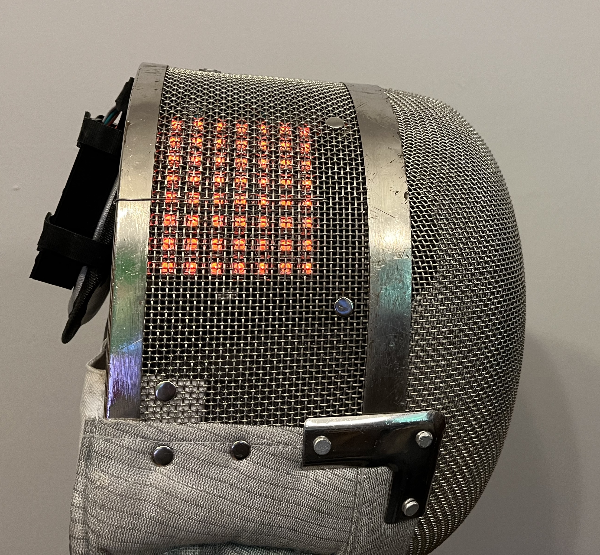
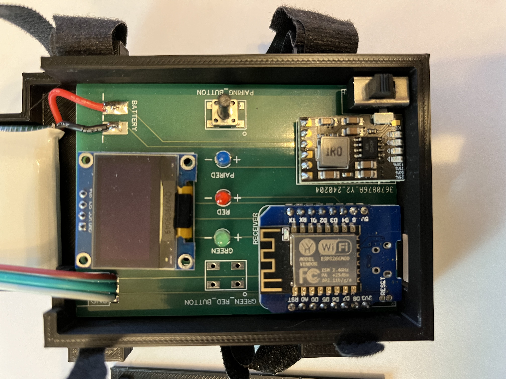

# Mask Lights #

This project is a simple, inexpensive and scalable method of relaying the Red and Green scoring lights from a [Favero Full-Arm-05](https://www.favero.com/en2_fencing_sport_electronic_scoreboard_fencing_signalling_equipment_apparatus_for_foil_sword_epee_sabre-29-17.html) scoring machine to LED lights attached to the interior sides of a fencing mask. The cost for a single light setup for a mask is about $15 USD and the transmitter cost is about $2 USD. Here is a [video](https://youtu.be/fLYSjWCZUGs?si=pZpLrBpt2Z_UCb3P) of the lights while fencing..

## Parser and Transmitter ##

The output data from the Favero using an [RJ11](https://www.aliexpress.us/item/2251832602517821.html) Connector to an [Arduino ESP8266 WeMos D1 Mini](https://www.aliexpress.us/item/3256805831695231.html) using the wiring [Favero Serial Parser schematic](Schematic_Favero-Light-Relays.pdf) with the exception that the LED Relay Control was left off for this build. The Arduino code [8266 Parser and Transmitter Favero](8266_Parser_and_Transmitter_Favero) was then uploaded the Wemos. The only change that should be needed to the code is line 4, "Favero_One", which is the scoring machine's name. The code should function either way, but it will be easier to use if each scoring machine has a unique name. The code uses the Wemos' MAC address to differentiate between scoring machines, but the human interface uses the name defined by line 4. The code used for the Transmitter is [8266_Parser_and_Transmitter](8266_Parser_and_Transmitter).

## Receiver ##

The code used for the Receiver is [8266_Receiver_Mask_Lights](8266_Receiver_Mask_Lights).

The [circuit for the LED Lights Receiver](Schematic_Mask_Lights_PCB.pdf) was then designed and the [PCB](PCB_Top.PNG) ordered using the [gerber file](Gerber_Mask_Lights_PCB.zip). Some of the parts used where an [OLED SSD1306](https://www.aliexpress.us/item/3256805784586367.html), a [MH-CD42 Charging Module](https://www.aliexpress.us/item/2255799917197675.html), [stout 15mm tall push buttons](https://www.aliexpress.us/item/2251832725948381.html), [3mm LEDs](https://www.aliexpress.us/item/3256805857472652.html), a [power switch](https://www.aliexpress.us/item/3256803752541650.html), a [LiPo 3.7V battery](https://www.aliexpress.us/item/3256806371239803.html) and an [8 by 8 LED Matrix](https://www.aliexpress.us/item/3256801079332896.html). A couple of notes on the PCB design, it is functional but by no means optimized and there are a couple of errors. Specifically the Green_Red_Button connects to D0/GPIO16 which is internally pulled down so the button, which is connected to GND, should instead be connected to 3.3V and therefore the button will not function. The Arduino code is adapted to not use the left Green_Red_Button.

To operate the interface, the OLED SSD1306 will initially display "Select Box". Pressing the button will cycle to first detected transmitter and will display the "Green" lights. Pressing the button again will receive from the same transmitter but will now display the "Red" lights. Pressing the button again will now cycle to the next transmitter and cycle through "Green"/"Red" until the list is exhausted and start over at "Select Box". For a large number of transmitters this can become tedious, at present this is not designed for more than a handful of transmitters.

Also, the Battery connection markings are reversed and the + and - are marked backwards from what they actually are on the circuit. If you connect the battery as indicated, as one would reasonably do, the PCB will start to heat up and smoke. 

There are also slightly different designs of the SSD1306, one of the designs has the Vcc and GND reversed from the one used in the PCB design; I would recommend using the SSD1306 that lines up with the PCB. Similarly, the pins for the power switch also line up poorly, so they require mechanical inducement to fit, though it does make switch feel more snug in the PCB. 

The Pairing LED is also redundant. There was initially a goal to pair with other Arduinos before transmitting the data but I decided it would be simpler and more straightforward to broadcast the scoring machine data instead of first establishing a paired connection.

The PCB is stored in a [3D printed enclosure](https://cad.onshape.com/documents/9127cf46288eeb6dc56328e9/w/f2f425a857582dd788254ce1/e/b9644c77b763d9ce140f913f?renderMode=0&uiState=6640f95af08a9a25bbff4b10) and secured to the mask using [velcro straps](https://www.aliexpress.us/item/3256806755948519.html). The LED matrix was connected to the mask using [lockwire](https://www.aliexpress.us/item/3256803467852184.html), though there may be better alternatives and I worry about sharp edges despite dulling the edge afterwards. I use [magnetic usb chargers](https://www.aliexpress.us/item/3256805633947608.html) to protect the Wemos USB connection and hopefully prolong its life.

## Relay Receiver ##

I included the code [8266_Receiver_Relay](8266_Receiver_Relay). The code acts similarly to the mask receiver except a High/Low signal is passed using the same receiver PCB at the Green and Red LED +/- connections and will send both Red and Green signals for both "clicks" of the button. This allows someone to connect relays to the PCB and actuate repeater lights using the same platform, enclosures and boards.

## Future Development ##

Some thoughts going forward, all the data from the box, mostly, is transmitted and the 8 by 8 matrix uses individually addressable LEDs, so more can be conveyed than solely the score lights. For example there could be indication of the score or a count down when the timer is about to run out.

Sleep Mode: The charging circuit is set up so that power is applied through the Arduino when charging. The power switch only isolates the Arduino from power when the Arduino is powered from the battery. One goal will be to create a sleep mode so that when charging, the Arduino will be less active.

Add code to momentarily light the LEDs when changing between which box is being monitored. This will allow to test the LEDs and feel reassuring that the system works.

Since the Receiver is effectively part of the mask and most masks are owned by a single person, it would be reasonably easy for a fencer to customize their lights making the lighting display unique to them or could display their national colors. This can then be further simplified by adjusting the code so that the actual code to light the LEDs is external to the main program and therefore easily changed or swapped out.

Adapt the interface button so that it can easily accommodate many more transmitters.

This can of course can be adapted to other scoring machines as well. It would be reasonable to use the other repositories on this Github to transmit both St. George Machines and the Virtual Scoring Machine.
